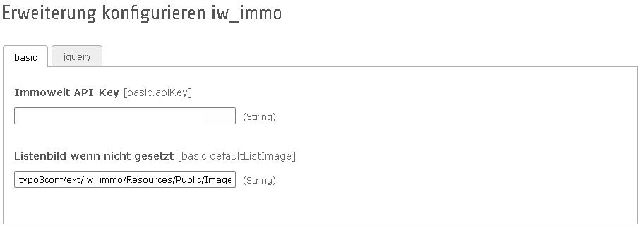
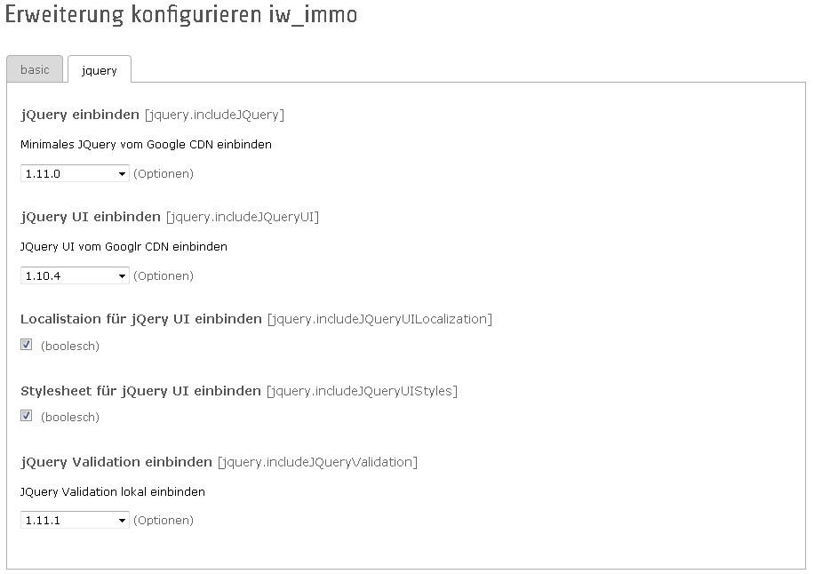

.. ==================================================
.. FOR YOUR INFORMATION
.. --------------------------------------------------
.. -*- coding: utf-8 -*- with BOM.

.. include:: ../../Includes.txt

Voraussetzungen und Installation
================================

Die Extension kann über das TYPO3-Extension-Repository herunter geladen werden.
Binden Sie zur Nutzung der Extension das statische Template (iw_immo) in ihr Root-Page Template ein.
Die Extension-Plugins können per TypoScript oder Flexform auf den Seiten eingebunden werden.

In der Extension-Konfiguration müssen Sie ihren API-Key hinterlegen. Zudem kann ein Default-Listenbild angegeben werden, das angezeigt wird, wenn Immobilienobjekte keine Bilder enthalten.

	**IwImmo-Konfiguration basic:** Tragen Sie hier Ihren Immowelt API-Key ein. Als Immowelt-Partner können Sie ihren API-Key jederzeit hier_ anfordern.

______________________________________________________________________________________________________________________________________

IwImmo nutzt die JavaScript-Bibliothek JQuery.
Wird auf der Website bisher kein JQuery benutzt, kann in der Extension-Konfiguration eingestellt werden,
ob und welche Version der jQuery-Bibliotheken auf der Website eingebunden werden soll.

	**IwImmo-Konfiguration jQuery**

.. _hier: http://www.immowelt.de/anbieten/gewerbe/extras/typo3extension.aspx

