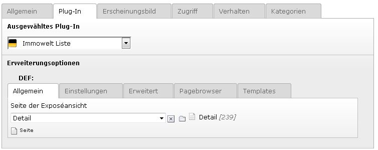
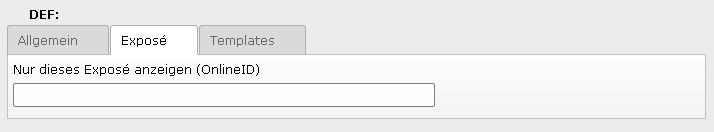

.. ==================================================
.. FOR YOUR INFORMATION
.. --------------------------------------------------
.. -*- coding: utf-8 -*- with BOM.

.. include:: ../../Includes.txt

Flexforms
================

Plugin-Auswahl
""""""""""""""

	IwImmo bietet Ihnen zusätzliche Seiteninhaltselemente im Backend. Im Reiter "Immowelt AG" können die einzelnen IwImmo-Plugins ausgewählt werden.

______________________________________________________________________________________________________________________________________

Template-Auswahl
""""""""""""""""

	Die mitgelieferten Standard-Templates der Extension können durch eigene ausgetauscht werden.
	Jeder IwImmo-Plugin-Typ enthält den Reiter "Templates", in dem Sie die Pfade für die eigenen Template-Dateien hinterlegen können.

______________________________________________________________________________________________________________________________________

Suche
"""""

	Ist der Plugin-Typ "Immowelt Suche" ausgewählt muss im Reiter "Allgemein" die gewünschte Seite angegeben werden, auf der das Listen-Plugin liegt.

	Im Reiter "Einstellungen" des Plugins "Immowelt Suche" stellen Sie das Land ein, in dem gesucht werden soll.
	Bitte beachten: Auf der Objektliste muss der gleiche Wert eingestellt sein.

______________________________________________________________________________________________________________________________________

Liste
"""""

	Ist der Plugin-Typ "Immowelt Liste" ausgewählt, muss im Reiter "Allgemein" die gewünschte Seite angegeben werden, auf der das Detail-Plugin liegt.

	Im Reiter "Einstellungen" des Plugins "Immowelt Liste" können Sie voreinstellen, welche Objekte auf der Listenseite angezeigt werden. Dies ist vor allem sinnvoll bei Listen, denen keine Suche vorgeschaltet ist. Wenn Sie ein Suchformular vorgeschaltet haben, überschreiben die dort eingegebenen Suchparameter die Voreinstellung.

+----------------------------------------------------------------+
| Sie können folgende Einstellungen über das Flexform vornehmen: |
+----------------------------------------------------------------+

+----------------------------------+----------------------------------------------------------------------------------------+
| Objektart (Miete/Kauf)           | Einschränkung der Immobilienliste auf Kauf- oder Mietobjekte.                          |
+----------------------------------+----------------------------------------------------------------------------------------+
| Landauswahl                      | | Ländereinstellung für die Immobilienliste.                                           |
|                                  | | Bei vorgeschalteter Suche muss das Land mit dem der Suche übereinstimmen.            |
+----------------------------------+----------------------------------------------------------------------------------------+
| Immobilienarten                  | | Einschränkung der Immobilieniste auf Immobilienarten.                                |
|                                  | | Es können mehrere Wert kommasepariert angegeben werden.                              |
|                                  | | Für Ausschluss von Objekten Werte mit einem '-'angeben.                              |
|                                  | | :ref:`Immobilienarten`                                                               |
+----------------------------------+----------------------------------------------------------------------------------------+
| Immobilienkategorien             | | Einschränkung der Immobilienliste auf Immoiblienkategorien.                          |
|                                  | | Es können mehrere Wert kommasepariert angegeben werden.                              |
|                                  | | Für Ausschluss von Objekten Werte mit einem '-' angeben.                             |
|                                  | | :ref:`Immobilienarten`                                                               |
+----------------------------------+----------------------------------------------------------------------------------------+
| Ausstattungsmerkmale             | | Einschränkung der Immobilienliste auf Objekte mit angegebenen Ausstattungsmerkmalen. |
|                                  | | Es können mehrere Wert kommasepariert angegeben werden.                              |
|                                  | | Für Ausschluss von Objekten Werte mit einem '-' angeben.                             |
|                                  | | :ref:`Ausstattungsmerkmale`                                                          |
+----------------------------------+----------------------------------------------------------------------------------------+
| Mindestanzahl an Zimmern         | | Es werden in der Immobilienliste nur Objekte                                         |
|                                  | | mit mindestens der hier voreingestellten Zimmerzahl angezeigt.                       |
+----------------------------------+----------------------------------------------------------------------------------------+
| Höchstanzahl an Zimmern          | | Es werden in der Immobilienliste nur Objekte                                         |
|                                  | | mit höchstens der hier voreingestellten Zimmerzahl angezeigt.                        |
+----------------------------------+----------------------------------------------------------------------------------------+
| Minimaler Kaufpreis / Miete      | | Es werden in der Immobilienliste nur Objekte angezeigt,                              |
|                                  | | deren Preis bei dem hier voreingestellten Wert oder darüber liegt.                   |
+----------------------------------+----------------------------------------------------------------------------------------+
| Maximaler Kaufpreis / Miete      | | Es werden in der Immobilienliste nur Objekte angezeigt,                              |
|                                  | | deren Preis beim hier eingestellten Wert oder darunter liegt.                        |
+----------------------------------+----------------------------------------------------------------------------------------+

	Im Reiter "Erweitert" können Sie weitere Einstellungen des Plugins "Immowelt Liste" vornehmen

+-----------------------------------------------------------------------------------------------------+
| Sie können folgende Einstellungen über das Flexform vornehmen:                                      |
+-----------------------------------------------------------------------------------------------------+

+-------------------------------------------+-------------------------------------------------------------------------------------------+
| Objekt-Ids mit der Premiumplatzierung     | | Hier können Sie mittels kommaseparierter Liste Objekte als Premiumobjekte markieren.    |
|                                           | | Hierfür geben Sie die OnlineIDs dieser Objekte an.                                      |
|                                           | | Diese Objekte erhalten eine eigene CSS Klasse (premium).                                |
+-------------------------------------------+-------------------------------------------------------------------------------------------+
| Maximale Anzahl an Ausstattungsmerkmale   | | Hier schränken Sie die Anzahl der Ausstattungsmerkmale ein, die auf der Listenansicht   |
|                                           | | angezeigt werden.                                                                       |
+-------------------------------------------+-------------------------------------------------------------------------------------------+

	Im Reiter "Pagebrowser" nehmen Sie Einstellungen vor, die den Pagebrowser betreffen.

+-----------------------------------------------------------------------------------------------------+
| Sie können folgende Einstellungen über das Flexform vornehmen:                                      |
+-----------------------------------------------------------------------------------------------------+

+---------------------------------------------+--------------------------------------------------------------------+
| Maximale Objekte pro Liste                  | Anzahl der Objekte, die maximal Pro Seite angezeigt werden.        |
+---------------------------------------------+--------------------------------------------------------------------+
| Maximale Anzahl der Links in der Navigation | | Maximale Anzahl der Links zu einzelnen Seiten,                   |
|                                             | | die im Pagebrowser angezeigt werden sollen.                      |
+---------------------------------------------+--------------------------------------------------------------------+
| Sortierung über der Liste aktivieren        | Schalter um die Sortierung über der Liste zu aktivieren.           |
+---------------------------------------------+--------------------------------------------------------------------+
| Pagebrowser unter der Liste aktivieren      | Schalter um Pagebrowser unter der Liste ein- und auszublenden.     |
+---------------------------------------------+--------------------------------------------------------------------+

______________________________________________________________________________________________________________________________________

Detail
""""""

	Ist der Plugin-Typ "Immowelt Exposé" ausgewählt, muss im Reiter "Allgemein" die gewünschte Seite angegeben werden, auf der das Finanzierungsrechner-Plugin liegt.

	Ist der Plugin-Typ "Immowelt Exposé" ausgewählt, können Sie im Reiter "Exposé" die Online-Id eines Objekts angeben, das auf der Detail-Ansicht
	unabhängig einer voreingestellten Liste angezeigt werden soll.
	:ref:`OnlineIds`

Kontaktformular
"""""""""""""""

	Ist der Plugin-Typ "Immowelt Kontaktformular" ausgewählt, müssen Sie im Reiter "Allgemein" die jeweiligen Seiten mit der Bestätigung (ebenfalls vom Plugin-Typ "Immowelt Kontaktformular"), dem Listen-Plugin sowie dem Detail-Plugin einstellen.

	Ist der Plugin-Typ "Immowelt Kontaktformular" ausgewählt, können im Reiter "Kontaktformular" weitere Einstellungen vorgenommen werden.

+-----------------------------------------------------------------------------------------------------+
| Sie können folgende Einstellungen über das Flexform vornehmen:                                      |
+-----------------------------------------------------------------------------------------------------+

+----------------------------------------+------------------------------------------------------------------------------------------+
| Absenderdomain                         | Hier legen Sie fest, welche Absender-Domain im Betreff der Anfrage angegeben wird.       |
+----------------------------------------+------------------------------------------------------------------------------------------+
| Nur dieses Exposé anzeigen (OnlineId)  | | Muss angegeben sein, wenn die Anfrage für ein Exposé-Plugin genutzt wird,              |
|                                        | | für das eine OnlineId hinterlegt ist.                                                  |
+----------------------------------------+------------------------------------------------------------------------------------------+

______________________________________________________________________________________________________________________________________

Finanzierungsrechner
""""""""""""""""""""

	Für den PluginTyp "Rechner" müssen Sie keine weiteren Einstellungen vornehmen.

